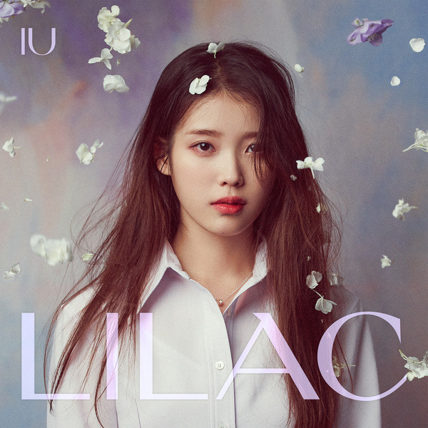
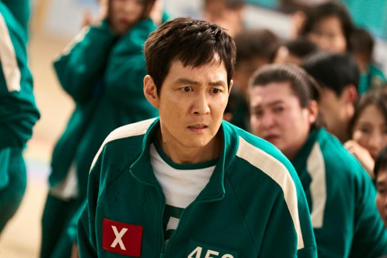

<!-- 
    title: Voice-Pro: Ultimate AI Voice Conversion and Multilingual Translation Tool
    description: Powerful AI-powered web application for YouTube video processing, speech recognition, translation, and text-to-speech with multilingual support
    keywords: AI voice conversion, YouTube translation, subtitle generation, speech-to-text, text-to-speech, voice cloning, multilingual translation, ElevenLabs Alternative 
    author: ABUS
    version: 2.0.0
    last-updated: 2025-02-23
    product-type: AI Multimedia Processing Software
    platforms: Windows
    technology-stack: Whisper, Edge-TTS, Gradio, CUDA, Faster-Whisper, Whisper-Timestamped, WhisperX, E2-TTS, F5-TTS, YouTube Downloader, Demucs, MDX-Net, RVC, CosyVoice, kokoro
    license: LGPL
-->

<h1 align="center">
Voice-Pro
</h1>

<p align="center">
  <i align="center">The best AI speech recognition, translation, and multilingual dubbing solution 🚀</i>
</p>

<h4 align="center">
  <a href="https://deepwiki.com/abus-aikorea/voice-pro">
    
  </a>
  <a href="https://www.youtube.com/channel/UCbCBWXuVbk-OBp9T4H5JjAA">
    
  </a>
  <a href="https://www.amazon.com/dp/B0F1LQZ42T">
    
  </a>
  <a href="https://r17wvy-t2.myshopify.com">
    
  </a>
    <a href="https://www.buymeacoffee.com/abus">
    
  </a>
  <a href="https://github.com/abus-aikorea/voice-pro/releases">
    
  </a>
  <a href="https://github.com/abus-aikorea/voice-pro/stargazers">
    
  </a>

</h4>

<p align="center">
    
</p>


## 🎙️ An AI-powered web application for speech recognition, translation, and dubbing


<p>  
  <a href="docs/README.kor.md">
     한국어
  </a> ∙ 
  <a href="docs/README.eng.md">
     English
  </a> ∙ 
  <a href="docs/README.zh.md">
     中文简体
  </a> ∙ 
  <a href="docs/README.tw.md">
     中文繁體
  </a> ∙ 
  <a href="docs/README.jpn.md">
     日本語
  </a> ∙ 
  <a href="docs/README.deu.md">
     Deutsch
  </a> ∙ 
  <a href="docs/README.spa.md">
     Español
  </a> ∙ 
  <a href="docs/README.por.md">
     Português
  </a>
</p>


Voice-Pro is a state-of-the-art web app that transforms multimedia content creation. It integrates YouTube video downloading, voice separation, speech recognition, translation, and text-to-speech into a single, powerful tool for creators, researchers, and multilingual professionals.
- 🔊 Top-tier speech recognition: **Whisper**, **Faster-Whisper**, **Whisper-Timestamped**, **WhisperX**
- 🎤 Zero-shot voice cloning: **F5-TTS**, **E2-TTS**, **CosyVoice**
- 📢 Multilingual text-to-speech: **Edge-TTS**, **kokoro** (Paid version includes **Azure TTS**)
- 🎥 YouTube processing & audio extraction: **yt-dlp**
- 🌍 Instant translation for 100+ languages: **Deep-Translator** (Paid version includes **Azure Translator**)


A robust alternative to **ElevenLabs**, Voice-Pro empowers podcasters, developers, and creators with advanced voice solutions.

## ⚠️ Please Note
- **Upgrading from v2.x to v3.x**: Not possible. We recommend deleting the `installer_files` folder and running the latest version of `start.bat`.
- **Upgrading from v3.x to v3.x**: Possible. After downloading the latest code, run `update.bat`.
- **First-time users**: Please refer to the installation instructions below.
- **Troubleshooting**: In most cases, issues can be resolved by deleting the `installer_files` folder and then running `configure.bat` followed by `start.bat`.
- 🎁 **Free Activation Key Request**: Please fill out this [Google Forms](https://forms.gle/anMSmsR5dH9wxE6N6) to receive your activation key. Activation keys are limited to one per email address.
- 🏆 **Request for Additional Activation Keys**: Create amazing content using Voice-Pro. Please share the link to your post in the [](https://github.com/abus-aikorea/voice-pro/discussions). We will gladly reward your contributions.

## 📰 News & History

<details open>
<summary>version 3.1</summary>

- 🪄 Support for fine-tuned models of **F5-TTS**
- 🌍 Supported languages
  -  English &  Chinese: <a href="https://huggingface.co/SWivid/F5-TTS/tree/main/F5TTS_v1_Base"> SWivid/F5-TTS_v1 </a> 
  -  Finnish: <a href="https://huggingface.co/AsmoKoskinen/F5-TTS_Finnish_Model"> AsmoKoskinen/F5-TTS_Finnish_Model </a> 
  -  French: <a href="https://huggingface.co/RASPIAUDIO/F5-French-MixedSpeakers-reduced"> RASPIAUDIO/F5-French-MixedSpeakers-reduced </a> 
  -  Hindi: <a href="https://huggingface.co/SPRINGLab/F5-Hindi-24KHz"> SPRINGLab/F5-Hindi-24KHz </a>  
  -  Italian: <a href="https://huggingface.co/alien79/F5-TTS-italian"> alien79/F5-TTS-italian </a>  
  -  Japanese: <a href="https://huggingface.co/Jmica/F5TTS/tree/main/JA_21999120"> Jmica/F5TTS/JA_21999120 </a>  
  -  Russian: <a href="https://huggingface.co/hotstone228/F5-TTS-Russian"> hotstone228/F5-TTS-Russian </a> 
  -  Spanish: <a href="https://huggingface.co/jpgallegoar/F5-Spanish"> jpgallegoar/F5-Spanish </a> 
  
</details>

<details open>
<summary>version 3.0</summary>

- 🔥 Removed the **AI Cover** feature.  
- 🚀 Added support for **m-bain/whisperX**.
  
</details>

<details>
<summary>version 2.0</summary>

- 🐍 Built with Python 3.10.15, Torch 2.5.1+cu124, and Gradio 5.14.0.  
- 🆓 Free trial supports media up to **60 seconds** in length.  
- 🔥 Added the **AI Cover** feature.  
- 🎤 Introduced support for **CosyVoice** and **kokoro**.  
- ⏳ Initial run downloads **CozyVoice2-0.5B (9GB)**, which may take over an hour depending on network speed.  
- 🎧 Voice samples for cloning will be continuously updated.  
- 📝 Added **spaCy** for natural sentence-by-sentence translation and TTS.  
- ☁️ Subscription version includes **Microsoft Azure** Translator and TTS.  
- 🏪 Subscription offers **unlimited usage** (no 60-second limit) during the subscription period, available via [](https://r17wvy-t2.myshopify.com).
  
</details>


## 🎥 YouTube Showcase

<table style="border-collapse: collapse; width: 100%;">
  <tr>
    <td style="padding: 10px; border: none;" align="center">
      <a href="https://youtu.be/scC5CicZ6G0" style="text-decoration: none; color: inherit;">
        
        <br>
        <span style="font-size: 16px; font-weight: 600; color: #0f0f0f; line-height: 1.2;">Demo for Voice-Pro (v2.0)</span>
      </a>
    </td>
    <td style="padding: 10px; border: none;" align="center">
      <a href="https://youtu.be/Wfo7vQCD4no" style="text-decoration: none; color: inherit;">
        
        <br>
        <span style="font-size: 16px; font-weight: 600; color: #0f0f0f; line-height: 1.2;">F5-TTS: Voice Cloning</span>
      </a>
    </td>
    <td style="padding: 10px; border: none;" align="center">
      <a href="https://youtu.be/GOzCDj4MCpo" style="text-decoration: none; color: inherit;">
        
        <br>
        <span style="font-size: 16px; font-weight: 600; color: #0f0f0f; line-height: 1.2;">Live Transcription & Translation</span>
      </a>
    </td>
    <td style="padding: 10px; border: none;" align="center">
      <a href="https://youtu.be/YdAq80wjtuQ" style="text-decoration: none; color: inherit;">
        
        <br>
        <span style="font-size: 16px; font-weight: 600; color: #0f0f0f; line-height: 1.2;">Multi-Lingual Voice Cloning: Korean - German</span>
      </a>
    </td>
  </tr>
  <tr>
    <td style="padding: 10px; border: none;" align="center">
      <a href="https://youtu.be/Tu2okoHY174" style="text-decoration: none; color: inherit;">
        
        <br>
        <span style="font-size: 16px; font-weight: 600; color: #0f0f0f; line-height: 1.2;">Multi-Lingual Voice Cloning: English - Korean</span>
      </a>
    </td>
    <td style="padding: 10px; border: none;" align="center">
      <a href="https://youtu.be/dWCEwO56_7Y" style="text-decoration: none; color: inherit;">
        
        <br>
        <span style="font-size: 16px; font-weight: 600; color: #0f0f0f; line-height: 1.2;">Multi-Lingual Voice Cloning: Korean - Japanese</span>
      </a>
    </td>
    <td style="padding: 10px; border: none;" align="center">
      <a href="https://youtu.be/HXomwoKS3V4" style="text-decoration: none; color: inherit;">
        
        <br>
        <span style="font-size: 16px; font-weight: 600; color: #0f0f0f; line-height: 1.2;">NVIDIA RTX Video Super-Resolution</span>
      </a>
    </td>
    <td style="padding: 10px; border: none;" align="center">
      <a href="https://youtu.be/lZK7pLJBHb4" style="text-decoration: none; color: inherit;">
        
        <br>
        <span style="font-size: 16px; font-weight: 600; color: #0f0f0f; line-height: 1.2;">AI Karaoke</span>
      </a>
    </td>
  </tr>
  <tr>
    <td style="padding: 10px; border: none;" align="center">
      <a href="https://youtu.be/Co70lh95EsQ" style="text-decoration: none; color: inherit;">
        
        <br>
        <span style="font-size: 16px; font-weight: 600; color: #0f0f0f; line-height: 1.2;">Multi-Lingual Voice Cloning: English - Korean</span>
      </a>
    </td>
  </tr>  
</table>


## ⭐ Key Features

### 1. Dubbing Studio
- YouTube video downloads & audio extraction
- Voice separation with **Demucs**
- Supports 100+ languages for speech recognition & translation

### 2. Speech Technologies
- **Speech-to-Text:** **Whisper**, **Faster-Whisper**, **Whisper-Timestamped**, **WhisperX**
- **Text-to-Speech:** 
  - **Edge-TTS**: 100+ languages, 400+ voices
  - **E2-TTS**, **F5-TTS**, **CosyVoice**: Zero-shot cloning
  - **kokoro**: Ranked #2 in HuggingFace TTS Arena

### 3. Real-Time Translation
- Instant speech recognition
- Multilingual translation on the fly
- Customizable audio inputs


## 🤖 WebUI


### `Dubbing Studio` Tab
- All-in-one hub: YouTube downloads, noise removal, subtitles, translation, & TTS
- Supports all ffmpeg-compatible formats
- Output options: WAV, FLAC, MP3
- Subtitles & recognition for 100+ languages
- TTS with speed, volume, & pitch controls
  
<p align="center">
  
</p>  


### `Whisper Caption` Tab
- Subtitle-focused: 90+ languages
- Video-integrated subtitle display
- Word-level highlighting & denoise options

### `Translate` Tab
- Translation for 100+ languages
- Supports subtitle files (ASS, SSA, SRT, etc.)
- Real-time voice recognition & translation

<p align="center">
  
</p>  

### `Speech Generation` Tab
- Options: **Edge-TTS**, **F5-TTS**, **CosyVoice**, **kokoro**
- Celeb voice podcasts & multilingual support

<p align="center">
  
</p>  


## 🎤✨ Reference Voice

- Please request the voice you want to add on the Issues page. [Issues](https://github.com/abus-aikorea/voice-pro/issues/50)  


<details>
<summary>
English
</summary> <br />

<table>
  <tr>
    <td align="center"><br>Andrew Bustamante</td>
    <td align="center"><br>Andrew Huberman</td>
    <td align="center"><br>Avi Loeb</td>
    <td align="center"><br>Ben Shapiro</td>
    <td align="center"><br>Brett Johnson</td>
    <td align="center"><br>Brian Keating</td>
  </tr>
  <tr>
    <td align="center"><br>Coffeezilla</td>
    <td align="center"><br>Dan Carlin</td>
    <td align="center"><br>David Buss</td>
    <td align="center"><br>David Fravor</td>
    <td align="center"><br>David Kipping</td>
    <td align="center"><br>Dennis Whyte</td>
  </tr>
  <tr>
    <td align="center"><br>Donald Hoffman</td>
    <td align="center"><br>Donald Trump</td>
    <td align="center"><br>Douglas Murray</td>
    <td align="center"><br>Duncan Trussell</td>
    <td align="center"><br>Elon Musk</td>
    <td align="center"><br>Garry Nolan</td>
  </tr>
  <tr>
    <td align="center"><br>Jack Barsky</td>
    <td align="center"><br>James Sexton</td>
    <td align="center"><br>Jeff Bezos</td>
    <td align="center"><br>Joe Rogan</td>
    <td align="center"><br>John Mearsheimer</td>
    <td align="center"><br>Jordan Peterson</td>
  </tr>
  <tr>
    <td align="center"><br>Kanye 'Ye' West</td>
    <td align="center"><br>Mark Zuckerberg</td>
    <td align="center"><br>Michael Levin</td>
    <td align="center"><br>Michael Saylor</td>
    <td align="center"><br>Michio Kaku</td>
    <td align="center"><br>MrBeast</td>
  </tr>
  <tr>
    <td align="center"><br>Nick Lane</td>
    <td align="center"><br>Paul Rosolie</td>
    <td align="center"><br>Ryan Graves</td>
    <td align="center"><br>Sam Altman</td>
    <td align="center"><br>Sam Harris</td>
    <td align="center"><br>Stephen Wolfram</td>
  </tr>
  <tr>
    <td align="center"><br>Tucker Carlson</td>
    <td align="center"><br>Vitalik Buterin</td>
    <td align="center"><br>Yuval Harari</td>
    <td></td>
    <td></td>
    <td></td>
  </tr>
</table>
</details>


<details>
<summary>
Chinese
</summary> <br />

<table>
  <tr>
    <td align="center"><br>迪丽热巴 (Dílì Rèbā)</td>
    <td align="center"><br>蔡依林 (Cài Yīlín)</td>
    <td align="center"><br>吴亦凡 (Wú Yìfán)</td>
    <td align="center"><br>李易峰 (Lǐ Yìfēng)</td>
    <td align="center"><br>杨幂 (Yáng Mì)</td>
    <td align="center"><br>赵丽颖 (Zhào Lìyǐng)</td>
  </tr>
</table>
</details>


<details>
<summary>
Korean
</summary> <br />

<table>
  <tr>
    <td align="center"><br>BTS 진 (Jin)</td>
    <td align="center"><br>BTS RM</td>
    <td align="center"><br>IU (아이유)</td>
    <td align="center"><br>이병헌</td>
    <td align="center"><br>이정재</td>
    <td align="center"><br>유재석</td>
  </tr>
</table>
</details>


<details>
<summary>
Japanese
</summary> <br />

<table>
  <tr>
    <td align="center"><br>綾瀬はるか (Ayase Haruka)</td>
    <td></td>
    <td></td>
    <td></td>
    <td></td>
    <td></td>
  </tr>
</table>
</details>
<br />

## 💻 System Requirements
- **OS:** Windows 10/11 (64-bit) ※ Linux/Mac unsupported
- **GPU:** NVIDIA with CUDA 12.4 (recommended)
- **VRAM:** 4GB+ (8GB+ preferred)
- **RAM:** 4GB+
- **Storage:** 20GB+ free space
- **Internet:** Required


## 📀 Installation

Install Voice-Pro with ease using **configure.bat** and **start.bat**.


### 1. Get the Package

  + Clone or download the latest release (**Source code (zip)**) from  [](https://github.com/abus-aikorea/voice-pro/)
```bash
git clone https://github.com/abus-aikorea/voice-pro.git
```
  

### 2. Install & Run
1. 🚀 **configure.bat**
   - Sets up git, ffmpeg, and CUDA (if NVIDIA GPU)
   - Run once; takes 1+ hour with internet
   - Don’t close the command window
2. 🚀 **start.bat**
   - Launches Voice-Pro WebUI
   - First run installs dependencies (1+ hour)
   - Retry after deleting **installer_files** if issues arise

### 3. Update
- 🚀 **update.bat**: Refreshes Python environment (faster than reinstall)

### 4. Uninstall
- Run **uninstall.bat** or delete the folder (portable install)


## ❓Tips & Tricks

#### If Browser does not run automatically
- Close the Windows-Commnad window and run start.bat again.
- Run the browser directly and enter the address displayed in the Windows-Command window (e.g. **http://127.0.0.1:7870**) in the address bar.

#### If a CUDA Out-Of-Memory error occurs
- Check the GPU memory status in Windows Task Manager - Performance tab. 
- Set the Denoise level to 0 or 1. Denoise level 2 requires at least 8GB of GPU memory.
- Set Compute Type to int type. The float type has better quality, but requires more GPU memory.

#### How to improve the quality of subtitles?
- The quality of subtitles tends to improve with larger Whisper models, but this is not necessarily the case. large > medium > small > base > tiny 
- Among compute types, float type has good performance. The int type is a model that reduces GPU usage and increases speed through model quantization. On the other hand, performance decreases. 
- If you increase the denoise level, more background sounds will be removed, and only the remaining voice will be used for voice recognition. It does not always guarantee good results.
  


## 🚨 Notice
- This repository offers a **free trial** of Voice-Pro. 
- The free trial version of Voice-Pro allows you to process up to **60 seconds** of media.
- The subscription version supports Microsoft Azure TTS and Translator. Purchase it on [](https://r17wvy-t2.myshopify.com).


<table>
  <tr>
    <th></th>
    <th>Trial Version</th>
    <th>☕Contributor Version</th>
    <th>Subscription Version</th>
  </tr>
  <tr>
    <th>Media Length Limit</th>
    <td>60 seconds</td>
    <td>Unlimited</td>
    <td>Unlimited</td>
  </tr>
  <tr>
    <th>Translation Service</th>
    <td>Google Translate (Open Source)</td>
    <td>Google Translate (Open Source)</td>
    <td>Azure Translate (Microsoft)</td>
  </tr>
  <tr>
    <th>Text-to-Speech Service</th>
    <td>Edge TTS (Open Source)</td>
    <td>Edge TTS (Open Source)</td>
    <td>Azure TTS (Microsoft)</td>
  </tr>
</table>

<br />

## ⏳ SaaS Platforms for Subtitling, Translation, and TTS

The following table lists SaaS platforms supporting subtitling, translation, and text-to-speech (TTS/dubbing) functionalities. Costs are calculated for processing a 60-minute Korean video, including subtitle generation, English translation, and English dubbing, based on the latest available pricing data as of April 15, 2025.

| Platform        | Subtitling | Translation | TTS/Dubbing | Cost for 60-min Video (USD, Approx.) | Key Features                                                                 |
|-----------------|------------|-------------|-------------|-------------------------------------|------------------------------------------------------------------------------|
| **[Maestra](https://maestra.ai)**     | ✅         | ✅          | ✅          | $23.70                              | 125+ languages, real-time captions, SEO keyword extraction, 15-min free trial. |
| **[Kapwing](https://www.kapwing.com)**     | ✅         | ✅          | ✅          | $30~$40 (Pro plan, per minute)     | AI subtitles, 100+ language translations, auto lip-sync dubbing, free tier.   |
| **[VEED.IO](https://www.veed.io)**     | ✅         | ✅          | ❌          | $24~$36 (Pro plan, partial)        | 99.9% accurate subtitles, Instagram-optimized captions, intuitive editor.     |
| **[HappyScribe](https://happyscribe.com)** | ✅         | ✅          | ✅          | $36~$48 (Pay-as-you-go)            | 120+ languages, professional proofreading, secure, meeting transcription.     |
| **[Sonix](https://sonix.ai)**       | ✅         | ✅          | ✅          | $30~$40 (Standard plan)            | 54+ languages, 30-min free transcription, YouTube/Zoom integration.           |
| **[Descript](https://descript.com)**    | ✅         | ✅          | ✅          | $36~$48 (Creator plan)             | Text-based editing, Overdub TTS, filler word removal, 1-hour free transcription. |
| **[AppTek](https://apptek.ai)**      | ✅         | ✅          | ✅          | Custom pricing (Contact)            | Media-focused, custom models, metadata generation, cloud-based Workbench.     |
| **[Transkriptor](https://transkriptor.com)**| ✅         | ✅          | ❌          | $12~$18 (Pay-as-you-go)            | 100+ languages, YouTube link transcription, 99% accuracy, simple editor.      |

### Cost Calculation Details
- **[Maestra](https://maestra.ai)**: Premium Plan ($158/month, 1200 credits). 60-min video: 60 credits (subtitles) + 60 credits (translation) + 60 credits (dubbing) = 180 credits. Cost = (180/1200) * $158 = $23.70.[](https://maestra.ai/pricing)
- **[Kapwing](https://www.kapwing.com)**: Pro plan (\~$24/month, limited minutes). Estimated $0.50\~$0.67/min for subtitles+translation+dubbing (based on per-minute pricing trends). 60-min cost: $30\~$40. Exact pricing requires confirmation.
- **[VEED.IO](https://www.veed.io)**: Pro plan (\~$24/month). Subtitles+translation estimated at $0.40\~$0.60/min. No TTS, so partial processing. 60-min cost: $24\~$36. Confirm at [veed.io](https://veed.io).
- **[HappyScribe](https://happyscribe.com)**: Pay-as-you-go (\~$0.20/min transcription, $0.20/min translation, $0.20/min dubbing). 60-min cost: $36\~$48 (assuming combined services). Confirm at [happyscribe.com](https://happyscribe.com).
- **[Sonix](https://sonix.ai)**: Standard plan (\~$10/hour transcription, additional for translation/dubbing). Estimated $0.50\~$0.67/min total. 60-min cost: $30\~$40. Confirm at [sonix.ai](https://sonix.ai).
- **[Descript](https://descript.com)**: Creator plan (\~$24/month, limited hours). Estimated $0.60\~$0.80/min for subtitles+translation+dubbing. 60-min cost: $36\~$48. Confirm at [descript.com](https://descript.com).
- **[AppTek](https://apptek.ai)**: Custom pricing for enterprise. No public per-minute rates. Contact [apptek.ai](https://apptek.ai) for quotes.
- **[Transkriptor](https://transkriptor.com)**: Pay-as-you-go ($0.05\~$0.10/min transcription, similar for translation). No TTS, so partial processing. 60-min cost: $12\~$18. Confirm at [transkriptor.com](https://transkriptor.com).

### Notes
- **Cost for 60-min Video**: Costs are approximate and assume processing a 60-minute Korean video for subtitles, English translation, and English dubbing (where available). Platforms without TTS (e.g., VEED.IO, Transkriptor) reflect partial processing costs.
- **Language Support**: Most platforms support Korean and English. Verify specific language availability on their websites.
- **Use Cases**:
  - Media/Entertainment: AppTek, Maestra
  - Social Media: Kapwing, VEED.IO
  - Podcasts/Interviews: Sonix, Descript
  - E-learning/Global Content: Transkriptor, HappyScribe
- **Pricing Updates**: Pricing may vary due to plan changes or promotions. Check official websites for the latest details.
- For contributions or specific use case recommendations, open an issue or submit a pull request in this repository!

<br />

## ☕ Contributions

Hello, I'm David from the Voice-Pro team.
Our team discovers the best AI technologies in the industry and provides them for anyone to use easily and conveniently.
We are a small startup in Korea that has only been around for a year. We are working hard to help you and other creators produce great content.

Your ⭐⭐⭐⭐⭐ review would be greatly appreciated as it helps our business grow with you. Please help support our small team.

Thank you,
ABUS Customer Service

- If you want to participate in and help us with this project, feel free to create an [Issues](https://github.com/abus-aikorea/voice-pro/issues) 
- If something goes wrong, please submit a [Pull requests](https://github.com/abus-aikorea/voice-pro/pulls) to improve this project.
- Any type of contribution is welcome.
- For inquiries related to purchases, business partnerships, technical tuning, investments, and other matters, please contact us by email. (<abus.aikorea@gmail.com>)."
- If you like this project, please star this repository. We would greatly appreciate it. ⭐⭐⭐
- You can support Voice-Pro with a donation here:   
</a>
  <a href="https://www.buymeacoffee.com/abus">
  
</a>


## 📬 Contact
- Email: <abus.aikorea@gmail.com>
- Homepage (Korean): <https://abuskorea.imweb.me>
- Paid Version Purchase: [Shopify (Global)](https://r17wvy-t2.myshopify.com), [Naver (Korean)](https://smartstore.naver.com/abus)


## 🙏 Credits
* Demucs: <https://github.com/facebookresearch/demucs>
* yt-dlp: <https://github.com/yt-dlp/yt-dlp>
* gradio: <https://github.com/gradio-app/gradio>
* edge-TTS: <https://github.com/rany2/edge-tts>
* F5-TTS: <https://github.com/SWivid/F5-TTS.git>
* openai-whisper: <https://github.com/openai/whisper>
* faster-whisper: <https://github.com/SYSTRAN/faster-whisper>
* whisper-timestamped: <https://github.com/linto-ai/whisper-timestamped>
* whisperX: <https://github.com/m-bain/whisperX>
* CosyVoice: <https://github.com/FunAudioLLM/CosyVoice>
* kokoro: <https://github.com/hexgrad/kokoro>
* Deep-Translator: <https://github.com/nidhaloff/deep-translator>
* spaCy: <https://github.com/explosion/spaCy>


## ©️ Copyright
   by [ABUS](https://abuskorea.imweb.me)

